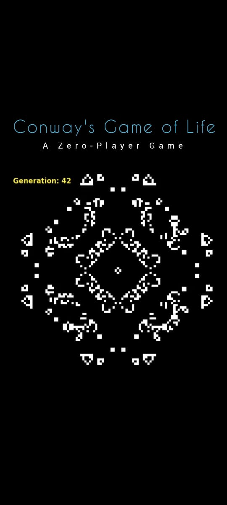

# Conway's-Game-of-Life

This repository contains a Simple Python implementation of Conway's Game of Life with different custom initial patterns, a classic cellular automaton devised by mathematician John Conway.

## Usage:
To run the simulation, execute the `game_of_life.ipynb` file on Google Colab or on local machine. Customize the board size, pattern, animation speed, and other parameters as needed.

## Contributing:

Contributions are welcome! Feel free to submit pull requests to improve the implementation.

## License:

This project is licensed under the MIT License - see the [LICENSE](LICENSE) file for details.
